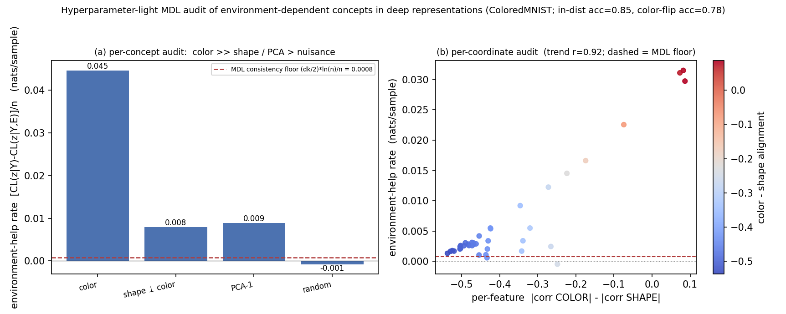

# MDL Representation Audit

A **hyperparameter-light Minimum Description Length (MDL) audit** of *environment-dependent*
(spurious / shortcut-like) dependencies in deep representations.

Preliminary code for a University of Tokyo research proposal
(大学院総合文化研究科 広域科学専攻 広域システム科学系, Prof. Shin Matsushima).

## Idea

Extend NML/MDL **latent-common-cause detection** (CLOUD; Kobayashi–Miyaguchi–Matsushima, 2024)
from raw variables to the **learned concept directions** of a *frozen* deep encoder.

For a representation `Z`, label `Y`, and environment indicator `E`, a two-part-MDL codelength
selects, per concept direction, among:

| model | meaning |
|---|---|
| `z ⊥ Y` | the direction carries no label information |
| `z \| Y` | label relation **shared across environments** → robust content |
| `z \| Y,E` | label relation **modulated by environment** → spurious / shortcut |

The model with the shortest codelength wins — **no tuned threshold**. An environment-modulated
relation flags a shortcut-like dependency; an environment-invariant one flags robust content.

## Result (ColoredMNIST)



A CNN is trained on ColoredMNIST (colour is a spurious, environment-flipped cue), then frozen.
The MDL audit assigns a far larger **environment-help rate** to the colour concept
(**0.045** nats/sample) than to shape-orthogonal (0.008) or nuisance (≈0) directions — all
measured against an explicit `(Δk/2)·log n / n` *consistency floor* — and the same score tracks
colour-alignment across individual representation coordinates (**r = 0.92**).

## Run (Modal)

```bash
pip install modal && modal token new     # one-time auth
modal run modal_nml_audit.py             # smoke test (small)
modal run modal_nml_audit.py --full      # full run → figures/fig1_mdl_audit_full.png
```

Dependencies (torch, torchvision, scikit-learn, matplotlib) are installed inside the Modal image;
nothing heavy is needed locally.

## Caveats (honest scope)

This is a **preliminary proof-of-concept**, not a finished validation. It uses **two-part Gaussian
MDL** (a stochastic-complexity approximation), not exact NML; concept directions are probed on the
same sample; and, by MDL consistency, at large `n` the discrete winner behaves like a significance
test (hence the **continuous rate** + the explicit floor). The audit detects *evidence of
shortcut-like dependence under specified model classes*, **not** causal identification.

## References

- Kobayashi, Miyaguchi & Matsushima, *Detection of Unobserved Common Causes based on NML Code* (CLOUD), arXiv:2403.06499, 2024.
- Miyaguchi, Matsushima & Yamanishi, *Sparse Graphical Modeling via Stochastic Complexity*, SDM 2017.
- Voita & Titov, *Information-Theoretic Probing with MDL*, EMNLP 2020.
- Arjovsky et al., *Invariant Risk Minimization*, 2019; Sagawa et al., *Group-DRO*, ICLR 2020.

## License

MIT
