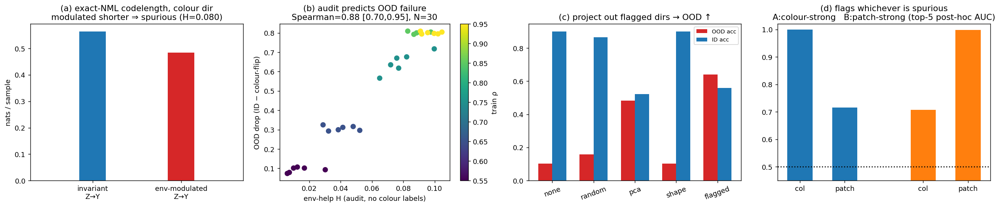

# MDL / NML Representation Audit

A **hyperparameter-light, exact-NML audit** of *environment-dependent* (spurious / shortcut-like)
dependencies in deep representations.

Preliminary code for a University of Tokyo master's research proposal
(大学院総合文化研究科 広域科学専攻 広域システム科学系, Prof. Shin Matsushima).

## Idea

Extend Matsushima's **CLOUD** (NML-code-based detection of unobserved common causes,
arXiv:2403.06499) from raw variables to the **learned directions** of a *frozen* deep encoder.
For each representation direction `z`, compare the codelength of an **environment-invariant**
`Z→Y` model against an **environment-modulated** one, using **exact multinomial NML stochastic
complexity** (Kontkanen–Myllymäki recurrence), *not* BIC. A shorter modulated code ⇒ the
direction's predictiveness is environment-dependent ⇒ shortcut-like.

## Results — ColoredMNIST (`modal_nml_audit_v2.py`)

The audit runs **without using the colour labels** (it audits PCA-basis directions):

1. **Exact NML, not BIC.** The colour direction's environment-modulated code is shorter than the
   invariant one (H = **0.080** nats/sample).
2. **Predicts OOD failure.** Across **30** independently trained CNNs, the in-distribution env-help
   score predicts the unseen colour-flip accuracy drop — **Spearman ρ = 0.88**, 95% CI [0.70, 0.95]
   (Pearson 0.975).
3. **Mitigation.** Projecting out the flagged directions and refitting only a linear head raises
   colour-flip OOD accuracy **0.10 → 0.64**, beating random / PCA / shape-direction controls.
4. **Not circular.** With two competing shortcuts (colour + a corner patch), the label-free audit
   flags whichever one the model actually relied on (colour-strong ⇒ colour dirs; patch-strong ⇒
   patch dirs).



## Run

```bash
pip install modal && modal token new       # one-time auth
modal run modal_nml_audit_v2.py --full     # ColoredMNIST, 30 CNNs, ~15 min on one GPU
```

Dependencies (torch, torchvision, scipy, scikit-learn, matplotlib) install inside the Modal image;
nothing heavy is needed locally. `modal_nml_audit.py` is the earlier single-model version.

## Honest scope

The audit detects environment-dependent shortcut directions under specified NML model classes,
predicts OOD degradation, and enables a simple projection-based mitigation. It is **not** a general
causal-discovery guarantee, and it analyses observed-environment structure (CLOUD-style), not an
exact hidden-latent solver.

## References

- Kobayashi, Miyaguchi, Matsushima. *Detection of Unobserved Common Causes based on NML Code* (CLOUD). arXiv:2403.06499, 2024.
- Miyaguchi, Matsushima, Yamanishi. *Sparse Graphical Modeling via Stochastic Complexity*. SDM 2017.
- Voita, Titov. *Information-Theoretic Probing with Minimum Description Length*. EMNLP 2020.
- Kontkanen, Myllymäki. *A linear-time algorithm for computing the multinomial stochastic complexity*. Information Processing Letters, 2007.

## License

MIT
